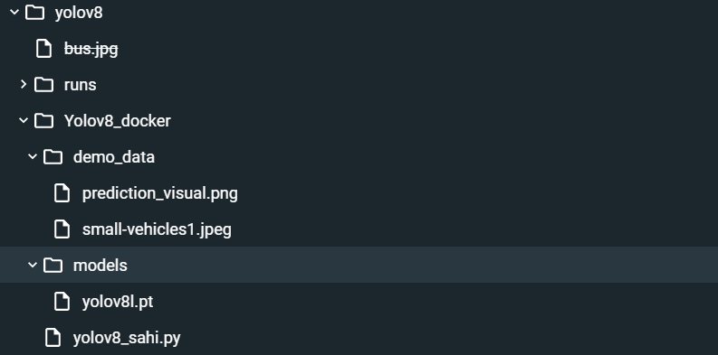
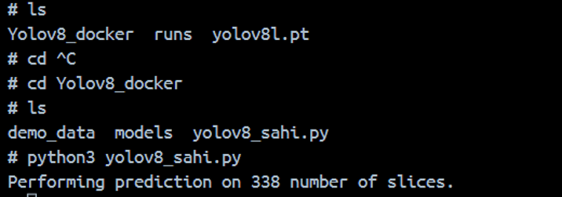

# Containerization of YOLOv8-L Inference With SAHI

Learn to build and deploy your distributed applications with Docker


## Installation
1. Install Docker: 

First, ensure that Docker is installed on your system. You can download and install Docker from the official Docker website: https://www.docker.com/get-started

## Getting Started

1.Build image out of Dockerfile

2.Run the image in the container

3.Testing YOLOv8: Object Detection 

4.Running Yolov8-L + SAHI Inference Inside The  Docker Container


## 1.   Build image out of Dockerfile
   Open a terminal or command prompt, navigate to the directory containing the Dockerfile, and run the following command to build the Docker image:

 ```bash
  docker build -t your_image_name .

```
## 2.   Run the image in the container

Once the image is built, you can run a Docker container from it using the following command:
 ```bash
 docker  run  –it   your_image_name

```
## 3.Testing YOLOv8: Object Detection 


1.Create directory to store input images and insert an image :
 ```bash
 mkdir inputs

```
2.Run this command to perform object detection :
 ```bash
 yolo predict model=yolov8l.pt  source=inputs/test.jpg

```
Result image will be saved to the /file/data/yolov8/runs/detect directory. 

## 4.  Running Yolov8-L + SAHI Inference Inside The  Docker Container
 1. Inside the container’s files Import the code and files needed to run the inference :

 
 2. Run the python file from the container's terminal for inference :
  ```bash
 cd Yolov8_docker
 python3 yolov8_sahi.py 

```


Once It’s done , you can view the result image  /demo_data/prediction_visual.png


## Authors

- [@Meryem Ben Salem](https://www.gitlab.com/meryem.bensalem25)

 


